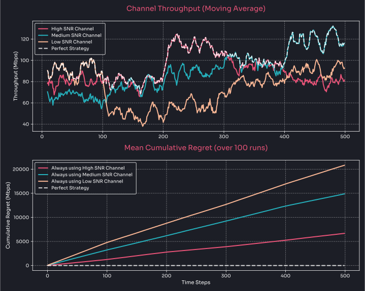
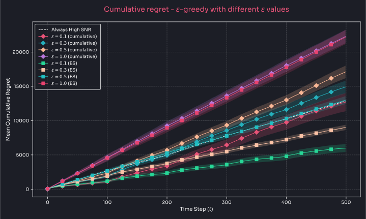
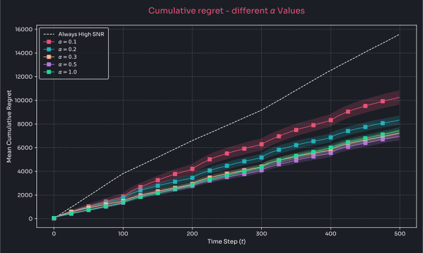
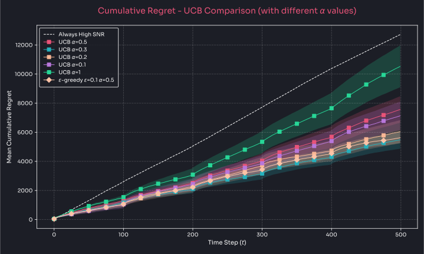

# Multi Armed Bandits in wireless networks

Wireless Multi-Armed Bandits Simulation: A Python implementation of Multi-Armed Bandit (MAB) algorithms for wireless channel selection, simulating realistic fading effects and strategies for optimizing channel selection.

strategies:
* [Epsilon-greedy with ES](strategy_epsilon_greedy.py)
* [Upper Confidence Bound (UCB) with ES](strategy_ucb.py)

other files:
* [channel.py](channel.py) - Basic wireless channel implementation with fading effects
* [mab_environment.py](mab_environment.py) - Core MAB simulation environment
* [mab_strategy_abc.py](mab_strategy_abc.py) - Abstract base class for strategies

## Usage

Simplest usage would be something like this:

```py
from mab_environment import WirelessMABEnvironment
from strategy_epsilon_greedy import EpsilonGreedyStrategy

# create environment with 3 channels
env = WirelessMABEnvironment(n_channels=3)

# run simulation with epsilon-greedy strategy
strategy = EpsilonGreedyStrategy(n_channels=3)
results = env.run_simulation(strategy)
```

## Simulations







